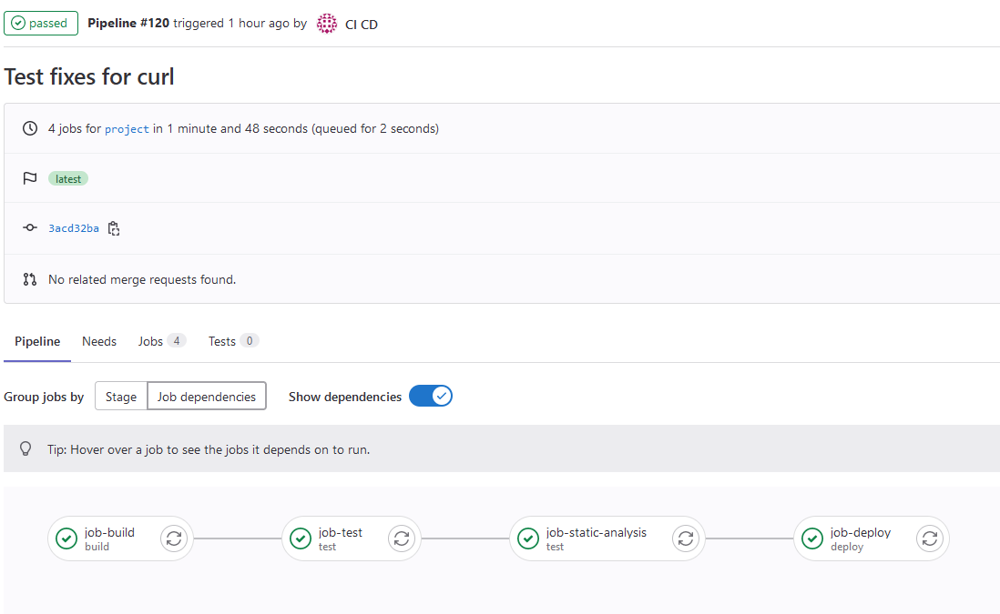
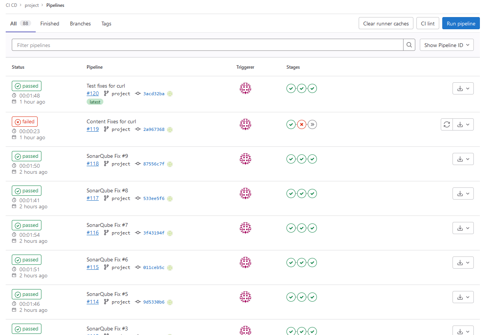
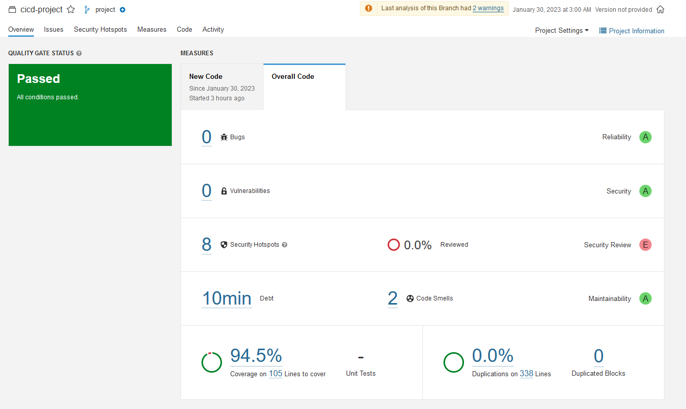

# cicd-project

## Implemented Optional Features
- implemented static analysis step in the pipeline by using SonarQube docker image
- implemented monitoring and logging for troubleshooting GET /statistic (HTML page as per instructions)
- implemented GET /node-statistic
- implemented GET /queue-statistic
- manual deployment to Azure Container Instances by following tutorial at https://learn.microsoft.com/en-us/azure/container-instances/tutorial-docker-compose

## Instructions on testing the system

### If testing without CI Setup
1. ```git clone -b project https://github.com/RaviVadera/cicd-project.git```
2. ```cd cicd-project```
3. ```docker-compose build –-no-cache```
4. ```docker-compose up --build --wait -d```
5. Run tests as necessary
6. Use ```docker ps``` command to observe changes in stack when INIT and SHUTDOWN states are provided
7. Once testing is done, ```docker compose down --volumes --timeout 100```

It is __IMPORTANT__ to use timeout when stopping the containers to allow nested stack and current stack to be stopped gracefully.
Docker compose has a default timeout of 10 seconds which may be too low when stopping whole stack.

### If testing with CI Setup
#### Setup Gitlab and Runner
1. Create necessary directories for volume mapping
```bash
mkdir gitlab-data
export GITLAB_HOME=~/gitlab-data
mkdir gitlab-runner
export GITLAB_RUNNER_HOME=~/gitlab-runner
```

2. Start Gitlab Container
    - To avoid conflicts with existing port mappings use 8XXX series ports
```bash
docker run -d -p 8000:80 -p 8443:443 -p 8022:22 --hostname <host_name> --name gitlab --restart always --volume $GITLAB_HOME/config:/etc/gitlab --volume $GITLAB_HOME/logs:/var/log/gitlab --volume $GITLAB_HOME/data:/var/opt/gitlab --shm-size 256m gitlab/gitlab-ce:15.7.0-ce.0
```
Use docker ps to check the status until it reports health check -> healthy

3. Start Gitlab Runner Container
```bash
docker run -d --name gitlab-runner --restart always --volume $GITLAB_RUNNER_HOME/config:/etc/gitlab-runner --volume /var/run/docker.sock:/var/run/docker.sock gitlab/gitlab-runner:v15.7.1
```
4. Navigate to localhost:8080 in browser
5. Register as a new user
    - The user needs approval from admin before logging-in
6. Retrieve password for admin
```bash
docker exec -it gitlab grep 'Password:' /etc/gitlab/initial_root_password
```
7. Login with username ```root``` and retrieved password from above step
8. Go to Admin from Menu
9. Navigate to Users -> Pending Approvals tab -> Click on Approve for the registered user
10. Logout as Admin
11. Login with registered user
12. Create a new project
13. Go to Settings -> CI / CD -> Scroll to Runners -> Click on Expand
14. Register the Runner
    - Use the registration token from above step
    - Use the hostname you used in url option
    - Use ```172.17.0.1``` if you used localhost as hostname (This is docker host IP, there are severay ways to retrieve this but that may be out of the scope of the project)
    - IMPORTANT: There is a security issue when using if-not-present pull policy, if some malicious image has been tagged with the required image, bad things can happen. However, considering the implementation for couse project, setting up the registry mirror is an overkill. [Reference](https://about.gitlab.com/blog/2020/10/30/mitigating-the-impact-of-docker-hub-pull-requests-limits/)
```bash
docker exec -it gitlab-runner gitlab-runner register --non-interactive --executor "docker" --docker-image ubuntu:20.04 --docker-volumes /var/run/docker.sock:/var/run/docker.sock --docker-pull-policy if-not-present --url "http://<host_name>:8000/" --clone-url "http://<host_name>:8000/" --registration-token <registration_token> --description "self-hosted-runner" --tag-list "docker,self-hosted" --run-untagged="true" --locked="false" --access-level="not_protected"
```
15. Verify runner is registered
    - Go to Settings -> CI / CD -> Scroll to Runners -> Click on Expand
    - The runner should show up

#### Setup SonarQube
1. Start SonarQube Container
```bash
docker run -d --name sonarqube --restart always -e SONAR_ES_BOOTSTRAP_CHECKS_DISABLE=true -p 9000:9000 sonarqube:latest
```
2. Login with default credentials at http://localhost:9000
    - Username: admin
    - Password: admin
3. Change the password for account and relogin
4. Create a new project
    - Setup manually
    - give a name for the project - prefferebly ```cicd-project``` so you won't have to update ```sonar-project.properties``` file
    - main branch should be set as ```project```
5. Setup Analysis with GitLab CI
    - Follow the steps provided from SonarQube admin
    - While configuring variables for GitLab CI, if you are using ```localhost``` as hostname, make sure to replace it with ```172.17.0.1``` (docker host IP)
    - Update the ```sonar-project.properties``` file with your configuration, specifically the project key
6. On next, push the static analysis should report errors in pipeline and detailed analysis on the SonarQube dashboard

#### Run Pipeline
1. Make some changes, preferably in this README file to simulate changes to codebase
2. ```git remote add gitlab <local_gitlab_clone_url>```
3. ```git add .```
4. ```git commit -m "Test Commit"```
5. ```git push gitlab```
6. Follow pipeline progress on GitLab UI
7. Once succeeded, the stack should be up and running on ```http://localhost:8083```
It may take some time for all of the services to be available. If you want, you can check repeatedly until the state from ```GET /state``` endpoint returns ```RUNNING```. That is a clear indication that the stack is up and running.
8. Run tests as necessary
9. Use ```docker ps``` command to observe changes in stack when INIT and SHUTDOWN states are provided
10. Once testing is done, ```docker compose down --volumes --timeout 100```

It is __IMPORTANT__ to use timeout when stopping the containers to allow nested stack and current stack to be stopped gracefully.
Docker compose has a default timeout of 10 seconds which may be too low when stopping whole stack.

### Manual deploy to Azure Container Instances
Follow the steps defined at https://learn.microsoft.com/en-us/azure/container-instances/tutorial-docker-compose to create container registry. Pay attention to installing pre-requisites.

1. Build and tag docker images for each application component. There are few,
    - gateway
    - mq
    - orig
    - imed
    - obse
    - httpserv
2. Replace the name of the container registry in compose-azure.yml files,
    - compose-azure.yml
    - app-stack/compose-azure.yml
3. Create volume mapping storage in Azure for necessary volumes by following this article https://learn.microsoft.com/en-us/azure/container-instances/container-instances-volume-azure-files. There are two volumes,
    - state_log
    - message_log
4. Skip the running stack locally part, make sure to use Azure context in docker and just run the docker compose up command.
    ```docker-compose up --build --wait -d```
5. Note down URL for the compose from Azure Portal
6. Run tests as necessary using the URL endpoints
7. Use ```docker ps``` command to observe changes in stack when INIT and SHUTDOWN states are provided
8. Once testing is done, ```docker compose down --timeout 100```

## Description of the CI / CD pipeline
### Version Management, Branch Organization
The version control is on GitHub at ```https://github.com/RaviVadera/cicd-project```. There are 3 branches on the repository,
- main -> empty except this README
- messaging -> previous codebase from exercide, copied over from old repo
- project -> the project codebase

There was confusion on whether to move the code from previous exercise on messaging to main. Hence, main is left empty.

### Build
Since the code for all of the application components are in vanilla JS (ES Syntax), which executes as it is, there was no reason to transpile or "build" code in a traditional sense. Package management tool, ```npm``` is utilized.

### Test
For testing, ```jest``` framework is utilized. Additionally, other tools such as ```supertest``` and ```mock-fs``` are also utilized to write "good tests" by mockign dependencies and concentrating more on validating unit-under-test. Organization of test cases are done by utilizing test suites.

Each file in the test folder at the location specified below are one test suite and tests one particular endpoint / method of ```gateway``` component. Learning are noted with comments on code and tests whenever there was a need of explanation.

Test coverage is also generated as part of the tests job for reporing to SonarQube.

__IMPORTANT NOTE__
With the current code architecture, it is very difficult to have all the tests in a folder in root of the project directory. That is why all of the tests are located at, ```gateway/test/*.test.js```

### Static Analysis
Once tests are passed and coverage report is generated, the SonarQube Scanner is executed to perform static analysis on the codebase and report findings to SonarQube instance's dashboard. The default settings of quality are kept as it is from SonarQube instance without any severe customization.

### Packaging
However, not a separate part of the CI pipeline by its own, each component in the application is packages as an individual docker image.

### Deployment
The pipeline's job step includes steps to install and configure docker before utilizing docker compose up command to spin up the stack. Docker compose stack has been utilized to orchestrate the containers and enable communication between those. Necessary ports are exposed through compose. The stack is setup as shown in the structur below,
- Windows Machine
    - WSL
        - Docker Engine and Compose
            - Dev Container -> For setting up isolated development environment
            - GitLab
            - GitLab Runner
            - GitLab Runner Containers for CI (only when CI is being executed)
            - Gateway Stack (Using Docker Compose, mapping docker.sock from WSL to GitLab Runners for deployment on host WSL)
            - App Stack (Using Docker Compose, mapping docker.sock from WSL to GitLab Runners to Gateway Stack for deployment on host WSL)

All of the necessary endpoints were mapped to WSL and by its nature available on Windows machine to test during development.

### Operating and Monitoring
Operating the stack as per specification provided. How to setup / manage optional components are mentioned earlier in this document.

The GET /statistic endpoint along with GET /run-log, GET /node-statistic and GET /queue-statistic can be utilized for monitoring.

The GET /statistic endpoint provides information such as,
- Gateway stack start time
- App stack status
- Number of requests received by gateway so far

Particulaly, the chosen metrices from /node-statistics are useful to monitor important metrics such as,
- whether there is a memory alarm (low / underperforming memory)
- whether there is a disk alarm (low / underperforming memory)
- number of sockets in use
- number of processess in use
- uptime of message broker

### Example runs of the pipeline
Total number of pipeline runs - 120

#### CI Pipeline Overview




#### __Failure Log from CI__
```bash
Running with gitlab-runner 15.7.1 (6d480948)
  on self-hosted-runner aCsCcYp6
Preparing the "docker" executor 00:02
Using Docker executor with image ubuntu:20.04 ...
Using locally found image version due to "if-not-present" pull policy
Using docker image sha256:d5447fc01ae62c20beffbfa50bc51b2797f9d7ebae031b8c2245b5be8ff1c75b for ubuntu:20.04 with digest ubuntu@sha256:0e0402cd13f68137edb0266e1d2c682f217814420f2d43d300ed8f65479b14fb ...
Preparing environment 00:01
Running on runner-acsccyp6-project-2-concurrent-0 via 882607e7c22a...
Getting source from Git repository 00:02
Fetching changes with git depth set to 20...
Reinitialized existing Git repository in /builds/cicd/project/.git/
Checking out 2a967368 as project...
Skipping Git submodules setup
Executing "step_script" stage of the job script 00:01
Using docker image sha256:d5447fc01ae62c20beffbfa50bc51b2797f9d7ebae031b8c2245b5be8ff1c75b for ubuntu:20.04 with digest ubuntu@sha256:0e0402cd13f68137edb0266e1d2c682f217814420f2d43d300ed8f65479b14fb ...
$ echo "Building..."
Building...
Job succeeded

Running with gitlab-runner 15.7.1 (6d480948)
  on self-hosted-runner aCsCcYp6
Preparing the "docker" executor 00:02
Using Docker executor with image node:16 ...
Using locally found image version due to "if-not-present" pull policy
Using docker image sha256:c910109adbfde7e534c61bae5795eefb86526598d620b1673fab79d5fa335cc2 for node:16 with digest node@sha256:64e8bcdfdad6718050801a2639f7e6645fdaf85ec37a98cdb61f6a5331217618 ...
Preparing environment 00:01
Running on runner-acsccyp6-project-2-concurrent-0 via 882607e7c22a...
Getting source from Git repository 00:01
Fetching changes with git depth set to 20...
Reinitialized existing Git repository in /builds/cicd/project/.git/
Checking out 2a967368 as project...
Skipping Git submodules setup
Executing "step_script" stage of the job script 00:12
Using docker image sha256:c910109adbfde7e534c61bae5795eefb86526598d620b1673fab79d5fa335cc2 for node:16 with digest node@sha256:64e8bcdfdad6718050801a2639f7e6645fdaf85ec37a98cdb61f6a5331217618 ...
$ cd gateway
$ npm ci
added 360 packages, and audited 361 packages in 5s
39 packages are looking for funding
  run `npm fund` for details
1 moderate severity vulnerability
To address all issues, run:
  npm audit fix
Run `npm audit` for details.
$ echo "Testing..."
Testing...
$ npm test
> gateway@1.0.0 test
> node --experimental-vm-modules node_modules/jest/bin/jest.js
(node:124) ExperimentalWarning: VM Modules is an experimental feature. This feature could change at any time
(Use `node --trace-warnings ...` to show where the warning was created)
(node:167) ExperimentalWarning: VM Modules is an experimental feature. This feature could change at any time
(Use `node --trace-warnings ...` to show where the warning was created)
(node:132) ExperimentalWarning: VM Modules is an experimental feature. This feature could change at any time
(Use `node --trace-warnings ...` to show where the warning was created)
(node:144) ExperimentalWarning: VM Modules is an experimental feature. This feature could change at any time
(Use `node --trace-warnings ...` to show where the warning was created)
(node:138) ExperimentalWarning: VM Modules is an experimental feature. This feature could change at any time
(Use `node --trace-warnings ...` to show where the warning was created)
(node:155) ExperimentalWarning: VM Modules is an experimental feature. This feature could change at any time
(Use `node --trace-warnings ...` to show where the warning was created)
(node:163) ExperimentalWarning: VM Modules is an experimental feature. This feature could change at any time
(Use `node --trace-warnings ...` to show where the warning was created)
(node:125) ExperimentalWarning: VM Modules is an experimental feature. This feature could change at any time
(Use `node --trace-warnings ...` to show where the warning was created)
PASS test/get-queue-statistic.test.js
PASS test/get-messages.test.js
PASS test/get-run-log.test.js
PASS test/get-statistic.test.js
PASS test/get-node-statistic.test.js
FAIL test/get-state.test.js
  ● GET /state › /state endpoint should respond with state
    expect(received).toBe(expected) // Object.is equality
    - Expected  - 0
    + Received  + 1
      RUNNING
    +
      35 |     expect(res.headers).toHaveProperty('content-type');
      36 |     expect(res.headers['content-type']).toBe('text/plain; charset=utf-8');
    > 37 |     expect(res.text).toBe(expectedContent);
         |                      ^
      38 |     const knownStates = Object.values(State);
      39 |     expect(knownStates.includes(res.text));
      40 |   });
      at Object.<anonymous> (test/get-state.test.js:37:22)
FAIL test/put-state.test.js
  ● PUT /state › /state endpoint should respond with new state
    expect(received).toBe(expected) // Object.is equality
    - Expected  - 0
    + Received  + 1
      RUNNING
    +
      61 |     expect(shutdownRes.headers).toHaveProperty('content-type');
      62 |     expect(shutdownRes.headers['content-type']).toBe('text/plain; charset=utf-8');
    > 63 |     expect(shutdownRes.text).toBe(State.RUNNING);
         |                              ^
      64 |     expect(knownStates.includes(shutdownRes.text));
      65 |
      66 |     const res = await request(app)
      at Object.<anonymous> (test/put-state.test.js:63:30)
PASS test/state-manager.test.js
------------------|---------|----------|---------|---------|-------------------
File              | % Stmts | % Branch | % Funcs | % Lines | Uncovered Line #s 
------------------|---------|----------|---------|---------|-------------------
All files         |   99.01 |    95.45 |     100 |   98.97 |                   
 gateway.js       |     100 |      100 |     100 |     100 |                   
 state-manager.js |   97.14 |    92.85 |     100 |   97.05 | 66                
------------------|---------|----------|---------|---------|-------------------
Test Suites: 2 failed, 6 passed, 8 total
Tests:       2 failed, 36 passed, 38 total
Snapshots:   0 total
Time:        4.086 s
Ran all test suites.
ERROR: Job failed: exit code 1
```

#### __Success Log from CI__
```bash
Running with gitlab-runner 15.7.1 (6d480948)
  on self-hosted-runner aCsCcYp6
Preparing the "docker" executor 00:03
Using Docker executor with image ubuntu:20.04 ...
Using locally found image version due to "if-not-present" pull policy
Using docker image sha256:d5447fc01ae62c20beffbfa50bc51b2797f9d7ebae031b8c2245b5be8ff1c75b for ubuntu:20.04 with digest ubuntu@sha256:0e0402cd13f68137edb0266e1d2c682f217814420f2d43d300ed8f65479b14fb ...
Preparing environment 00:01
Running on runner-acsccyp6-project-2-concurrent-0 via 882607e7c22a...
Getting source from Git repository 00:02
Fetching changes with git depth set to 20...
Reinitialized existing Git repository in /builds/cicd/project/.git/
Checking out 3acd32ba as project...
Removing gateway/coverage/
Removing gateway/node_modules/
Skipping Git submodules setup
Executing "step_script" stage of the job script 00:01
Using docker image sha256:d5447fc01ae62c20beffbfa50bc51b2797f9d7ebae031b8c2245b5be8ff1c75b for ubuntu:20.04 with digest ubuntu@sha256:0e0402cd13f68137edb0266e1d2c682f217814420f2d43d300ed8f65479b14fb ...
$ echo "Building..."
Building...
Job succeeded

Running with gitlab-runner 15.7.1 (6d480948)
  on self-hosted-runner aCsCcYp6
Preparing the "docker" executor 00:02
Using Docker executor with image node:16 ...
Using locally found image version due to "if-not-present" pull policy
Using docker image sha256:c910109adbfde7e534c61bae5795eefb86526598d620b1673fab79d5fa335cc2 for node:16 with digest node@sha256:64e8bcdfdad6718050801a2639f7e6645fdaf85ec37a98cdb61f6a5331217618 ...
Preparing environment 00:01
Running on runner-acsccyp6-project-2-concurrent-0 via 882607e7c22a...
Getting source from Git repository 00:02
Fetching changes with git depth set to 20...
Reinitialized existing Git repository in /builds/cicd/project/.git/
Checking out 3acd32ba as project...
Skipping Git submodules setup
Executing "step_script" stage of the job script 00:11
Using docker image sha256:c910109adbfde7e534c61bae5795eefb86526598d620b1673fab79d5fa335cc2 for node:16 with digest node@sha256:64e8bcdfdad6718050801a2639f7e6645fdaf85ec37a98cdb61f6a5331217618 ...
$ cd gateway
$ npm ci
added 360 packages, and audited 361 packages in 4s
39 packages are looking for funding
  run `npm fund` for details
1 moderate severity vulnerability
To address all issues, run:
  npm audit fix
Run `npm audit` for details.
$ echo "Testing..."
Testing...
$ npm test
> gateway@1.0.0 test
> node --experimental-vm-modules node_modules/jest/bin/jest.js
(node:124) ExperimentalWarning: VM Modules is an experimental feature. This feature could change at any time
(Use `node --trace-warnings ...` to show where the warning was created)
(node:131) ExperimentalWarning: VM Modules is an experimental feature. This feature could change at any time
(Use `node --trace-warnings ...` to show where the warning was created)
(node:157) ExperimentalWarning: VM Modules is an experimental feature. This feature could change at any time
(Use `node --trace-warnings ...` to show where the warning was created)
(node:143) ExperimentalWarning: VM Modules is an experimental feature. This feature could change at any time
(Use `node --trace-warnings ...` to show where the warning was created)
(node:150) ExperimentalWarning: VM Modules is an experimental feature. This feature could change at any time
(Use `node --trace-warnings ...` to show where the warning was created)
(node:164) ExperimentalWarning: VM Modules is an experimental feature. This feature could change at any time
(Use `node --trace-warnings ...` to show where the warning was created)
(node:137) ExperimentalWarning: VM Modules is an experimental feature. This feature could change at any time
(Use `node --trace-warnings ...` to show where the warning was created)
(node:125) ExperimentalWarning: VM Modules is an experimental feature. This feature could change at any time
(Use `node --trace-warnings ...` to show where the warning was created)
PASS test/get-node-statistic.test.js
PASS test/get-messages.test.js
PASS test/get-run-log.test.js
PASS test/get-queue-statistic.test.js
PASS test/get-state.test.js
PASS test/get-statistic.test.js
PASS test/put-state.test.js
PASS test/state-manager.test.js
------------------|---------|----------|---------|---------|-------------------
File              | % Stmts | % Branch | % Funcs | % Lines | Uncovered Line #s 
------------------|---------|----------|---------|---------|-------------------
All files         |     100 |      100 |     100 |     100 |                   
 gateway.js       |     100 |      100 |     100 |     100 |                   
 state-manager.js |     100 |      100 |     100 |     100 |                   
------------------|---------|----------|---------|---------|-------------------
Test Suites: 8 passed, 8 total
Tests:       38 passed, 38 total
Snapshots:   0 total
Time:        3.883 s
Ran all test suites.
$ cd ..
Job succeeded

Running with gitlab-runner 15.7.1 (6d480948)
  on self-hosted-runner aCsCcYp6
Preparing the "docker" executor 00:02
Using Docker executor with image sonarsource/sonar-scanner-cli:latest ...
Using locally found image version due to "if-not-present" pull policy
Using docker image sha256:a5403b12a9887f007789add88c4e8ebbf0c814976bc19e6a9afd5b0ec930190a for sonarsource/sonar-scanner-cli:latest with digest sonarsource/sonar-scanner-cli@sha256:e0eac589e9c5321576b89531d2fc38d141b17bbe695a831e43dbd5193d76ba26 ...
Preparing environment 00:01
Running on runner-acsccyp6-project-2-concurrent-0 via 882607e7c22a...
Getting source from Git repository 00:02
Fetching changes...
Reinitialized existing Git repository in /builds/cicd/project/.git/
Checking out 3acd32ba as project...
Skipping Git submodules setup
Restoring cache 00:03
Checking cache for job-static-analysis-non_protected...
No URL provided, cache will not be downloaded from shared cache server. Instead a local version of cache will be extracted. 
Successfully extracted cache
Executing "step_script" stage of the job script 00:28
Using docker image sha256:a5403b12a9887f007789add88c4e8ebbf0c814976bc19e6a9afd5b0ec930190a for sonarsource/sonar-scanner-cli:latest with digest sonarsource/sonar-scanner-cli@sha256:e0eac589e9c5321576b89531d2fc38d141b17bbe695a831e43dbd5193d76ba26 ...
$ sonar-scanner
INFO: Scanner configuration file: /opt/sonar-scanner/conf/sonar-scanner.properties
INFO: Project root configuration file: /builds/cicd/project/sonar-project.properties
INFO: SonarScanner 4.8.0.2856
INFO: Java 11.0.18 Alpine (64-bit)
INFO: Linux 5.15.79.1-microsoft-standard-WSL2 amd64
INFO: User cache: /builds/cicd/project/.sonar/cache
INFO: Analyzing on SonarQube server 9.8.0.63668
INFO: Default locale: "en_US", source code encoding: "UTF-8" (analysis is platform dependent)
INFO: Load global settings
INFO: Load global settings (done) | time=89ms
INFO: Server id: 147B411E-AYX9CMap3kjo6fJ2ewGl
INFO: User cache: /builds/cicd/project/.sonar/cache
INFO: Load/download plugins
INFO: Load plugins index
INFO: Load plugins index (done) | time=50ms
INFO: Load/download plugins (done) | time=112ms
INFO: Process project properties
INFO: Process project properties (done) | time=1ms
INFO: Execute project builders
INFO: Execute project builders (done) | time=2ms
INFO: Project key: cicd-project
INFO: Base dir: /builds/cicd/project
INFO: Working dir: /builds/cicd/project/.scannerwork
INFO: Load project settings for component key: 'cicd-project'
INFO: Load project settings for component key: 'cicd-project' (done) | time=24ms
INFO: Auto-configuring with CI 'Gitlab CI'
INFO: Load quality profiles
INFO: Load quality profiles (done) | time=100ms
INFO: Load active rules
INFO: Load active rules (done) | time=2055ms
INFO: Load analysis cache
INFO: Load analysis cache (341 bytes) | time=14ms
INFO: Load project repositories
INFO: Load project repositories (done) | time=13ms
INFO: Indexing files...
INFO: Project configuration:
INFO:   Included sources: gateway/*.js, gateway/app-stack/imed/*.js, gateway/app-stack/orig/*.js, gateway/app-stack/obse/*.js, gateway/app-stack/httpserv/*.js
INFO:   Excluded sources: gateway/test/*.test.js
INFO:   Included tests: gateway/test/*.test.js
INFO:   Excluded sources for coverage: gateway/app-stack/**
INFO: 12 files indexed
INFO: 4548 files ignored because of inclusion/exclusion patterns
INFO: 0 files ignored because of scm ignore settings
INFO: Quality profile for js: Sonar way
INFO: ------------- Run sensors on module cicd-project
INFO: Load metrics repository
INFO: Load metrics repository (done) | time=20ms
INFO: Sensor JaCoCo XML Report Importer [jacoco]
INFO: 'sonar.coverage.jacoco.xmlReportPaths' is not defined. Using default locations: target/site/jacoco/jacoco.xml,target/site/jacoco-it/jacoco.xml,build/reports/jacoco/test/jacocoTestReport.xml
INFO: No report imported, no coverage information will be imported by JaCoCo XML Report Importer
INFO: Sensor JaCoCo XML Report Importer [jacoco] (done) | time=2ms
INFO: Sensor JavaScript analysis [javascript]
INFO: 12 source files to be analyzed
INFO: 12/12 source files have been analyzed
INFO: Hit the cache for 0 out of 12
INFO: Miss the cache for 12 out of 12: ANALYSIS_MODE_INELIGIBLE [12/12]
INFO: Sensor JavaScript analysis [javascript] (done) | time=8663ms
INFO: Sensor TypeScript analysis [javascript]
INFO: No input files found for analysis
INFO: Hit the cache for 0 out of 0
INFO: Miss the cache for 0 out of 0
INFO: Sensor TypeScript analysis [javascript] (done) | time=2ms
INFO: Sensor CSS Rules [javascript]
INFO: No CSS, PHP, HTML or VueJS files are found in the project. CSS analysis is skipped.
INFO: Sensor CSS Rules [javascript] (done) | time=0ms
INFO: Sensor JavaScript/TypeScript Coverage [javascript]
INFO: Analysing [/builds/cicd/project/./gateway/coverage/lcov.info]
INFO: Sensor JavaScript/TypeScript Coverage [javascript] (done) | time=19ms
INFO: Sensor C# Project Type Information [csharp]
INFO: Sensor C# Project Type Information [csharp] (done) | time=1ms
INFO: Sensor C# Analysis Log [csharp]
INFO: Sensor C# Analysis Log [csharp] (done) | time=23ms
INFO: Sensor C# Properties [csharp]
INFO: Sensor C# Properties [csharp] (done) | time=1ms
INFO: Sensor HTML [web]
INFO: Sensor HTML [web] (done) | time=2ms
INFO: Sensor Text Sensor [text]
INFO: 12 source files to be analyzed
INFO: 12/12 source files have been analyzed
INFO: Sensor Text Sensor [text] (done) | time=13ms
INFO: Sensor VB.NET Project Type Information [vbnet]
INFO: Sensor VB.NET Project Type Information [vbnet] (done) | time=1ms
INFO: Sensor VB.NET Analysis Log [vbnet]
INFO: Sensor VB.NET Analysis Log [vbnet] (done) | time=23ms
INFO: Sensor VB.NET Properties [vbnet]
INFO: Sensor VB.NET Properties [vbnet] (done) | time=0ms
INFO: ------------- Run sensors on project
INFO: Sensor Analysis Warnings import [csharp]
INFO: Sensor Analysis Warnings import [csharp] (done) | time=1ms
INFO: Sensor Zero Coverage Sensor
INFO: Sensor Zero Coverage Sensor (done) | time=3ms
INFO: SCM Publisher SCM provider for this project is: git
INFO: SCM Publisher 12 source files to be analyzed
WARN: Shallow clone detected, no blame information will be provided. You can convert to non-shallow with 'git fetch --unshallow'.
INFO: SCM Publisher 0/12 source files have been analyzed (done) | time=9ms
WARN: Missing blame information for the following files:
WARN:   * gateway/app-stack/obse/listening.js
WARN:   * gateway/app-stack/obse/status.js
WARN:   * gateway/app-stack/obse/index.js
WARN:   * gateway/jest.config.js
WARN:   * gateway/state-manager.js
WARN:   * gateway/app-stack/orig/index.js
WARN:   * gateway/app-stack/imed/listening.js
WARN:   * gateway/index.js
WARN:   * gateway/app-stack/httpserv/index.js
WARN:   * gateway/app-stack/imed/index.js
WARN:   * gateway/gateway.js
WARN:   * gateway/app-stack/imed/status.js
WARN: This may lead to missing/broken features in SonarQube
INFO: CPD Executor 6 files had no CPD blocks
INFO: CPD Executor Calculating CPD for 6 files
INFO: CPD Executor CPD calculation finished (done) | time=8ms
INFO: Analysis report generated in 48ms, dir size=162.1 kB
INFO: Analysis report compressed in 29ms, zip size=42.8 kB
INFO: Analysis report uploaded in 36ms
INFO: ------------- Check Quality Gate status
INFO: Waiting for the analysis report to be processed (max 300s)
INFO: QUALITY GATE STATUS: PASSED - View details on http://172.17.0.1:9000/dashboard?id=cicd-project
INFO: Analysis total time: 24.555 s
INFO: ------------------------------------------------------------------------
INFO: EXECUTION SUCCESS
INFO: ------------------------------------------------------------------------
INFO: Total time: 25.965s
INFO: Final Memory: 17M/64M
INFO: ------------------------------------------------------------------------
Saving cache for successful job 00:01
Creating cache job-static-analysis-non_protected...
.sonar/cache: found 55 matching files and directories 
Archive is up to date!                             
Created cache
Job succeeded

Running with gitlab-runner 15.7.1 (6d480948)
  on self-hosted-runner aCsCcYp6
Preparing the "docker" executor 00:02
Using Docker executor with image ubuntu:20.04 ...
Using locally found image version due to "if-not-present" pull policy
Using docker image sha256:d5447fc01ae62c20beffbfa50bc51b2797f9d7ebae031b8c2245b5be8ff1c75b for ubuntu:20.04 with digest ubuntu@sha256:0e0402cd13f68137edb0266e1d2c682f217814420f2d43d300ed8f65479b14fb ...
Preparing environment 00:01
Running on runner-acsccyp6-project-2-concurrent-0 via 882607e7c22a...
Getting source from Git repository 00:02
Fetching changes with git depth set to 20...
Reinitialized existing Git repository in /builds/cicd/project/.git/
Checking out 3acd32ba as project...
Removing .scannerwork/
Removing .sonar/
Removing gateway/coverage/
Removing gateway/node_modules/
Skipping Git submodules setup
Executing "step_script" stage of the job script 00:42
Using docker image sha256:d5447fc01ae62c20beffbfa50bc51b2797f9d7ebae031b8c2245b5be8ff1c75b for ubuntu:20.04 with digest ubuntu@sha256:0e0402cd13f68137edb0266e1d2c682f217814420f2d43d300ed8f65479b14fb ...
$ apt-get update
Get:1 http://security.ubuntu.com/ubuntu focal-security InRelease [114 kB]
Get:2 http://archive.ubuntu.com/ubuntu focal InRelease [265 kB]
Get:3 http://security.ubuntu.com/ubuntu focal-security/main amd64 Packages [2442 kB]
Get:4 http://security.ubuntu.com/ubuntu focal-security/multiverse amd64 Packages [27.7 kB]
Get:5 http://security.ubuntu.com/ubuntu focal-security/restricted amd64 Packages [1882 kB]
Get:6 http://archive.ubuntu.com/ubuntu focal-updates InRelease [114 kB]
Get:7 http://security.ubuntu.com/ubuntu focal-security/universe amd64 Packages [988 kB]
Get:8 http://archive.ubuntu.com/ubuntu focal-backports InRelease [108 kB]
Get:9 http://archive.ubuntu.com/ubuntu focal/multiverse amd64 Packages [177 kB]
Get:10 http://archive.ubuntu.com/ubuntu focal/universe amd64 Packages [11.3 MB]
Get:11 http://archive.ubuntu.com/ubuntu focal/restricted amd64 Packages [33.4 kB]
Get:12 http://archive.ubuntu.com/ubuntu focal/main amd64 Packages [1275 kB]
Get:13 http://archive.ubuntu.com/ubuntu focal-updates/main amd64 Packages [2920 kB]
Get:14 http://archive.ubuntu.com/ubuntu focal-updates/multiverse amd64 Packages [31.2 kB]
Get:15 http://archive.ubuntu.com/ubuntu focal-updates/restricted amd64 Packages [2009 kB]
Get:16 http://archive.ubuntu.com/ubuntu focal-updates/universe amd64 Packages [1290 kB]
Get:17 http://archive.ubuntu.com/ubuntu focal-backports/universe amd64 Packages [28.6 kB]
Get:18 http://archive.ubuntu.com/ubuntu focal-backports/main amd64 Packages [55.2 kB]
Fetched 25.1 MB in 3s (7763 kB/s)
Reading package lists...
$ apt-get -y install ca-certificates curl gnupg lsb-release
Reading package lists...
Building dependency tree...
Reading state information...
The following additional packages will be installed:
  dirmngr distro-info-data file gnupg-l10n gnupg-utils gpg gpg-agent
  gpg-wks-client gpg-wks-server gpgconf gpgsm krb5-locales libasn1-8-heimdal
  libassuan0 libbrotli1 libcurl4 libexpat1 libgssapi-krb5-2 libgssapi3-heimdal
  libhcrypto4-heimdal libheimbase1-heimdal libheimntlm0-heimdal
  libhx509-5-heimdal libk5crypto3 libkeyutils1 libkrb5-26-heimdal libkrb5-3
  libkrb5support0 libksba8 libldap-2.4-2 libldap-common libmagic-mgc libmagic1
  libmpdec2 libnghttp2-14 libnpth0 libpsl5 libpython3-stdlib
  libpython3.8-minimal libpython3.8-stdlib libreadline8 libroken18-heimdal
  librtmp1 libsasl2-2 libsasl2-modules libsasl2-modules-db libsqlite3-0
  libssh-4 libssl1.1 libwind0-heimdal mime-support openssl pinentry-curses
  publicsuffix python3 python3-minimal python3.8 python3.8-minimal
  readline-common xz-utils
Suggested packages:
  dbus-user-session libpam-systemd pinentry-gnome3 tor parcimonie xloadimage
  scdaemon krb5-doc krb5-user libsasl2-modules-gssapi-mit
  | libsasl2-modules-gssapi-heimdal libsasl2-modules-ldap libsasl2-modules-otp
  libsasl2-modules-sql pinentry-doc python3-doc python3-tk python3-venv
  python3.8-venv python3.8-doc binutils binfmt-support readline-doc
The following NEW packages will be installed:
  ca-certificates curl dirmngr distro-info-data file gnupg gnupg-l10n
  gnupg-utils gpg gpg-agent gpg-wks-client gpg-wks-server gpgconf gpgsm
  krb5-locales libasn1-8-heimdal libassuan0 libbrotli1 libcurl4 libexpat1
  libgssapi-krb5-2 libgssapi3-heimdal libhcrypto4-heimdal libheimbase1-heimdal
  libheimntlm0-heimdal libhx509-5-heimdal libk5crypto3 libkeyutils1
  libkrb5-26-heimdal libkrb5-3 libkrb5support0 libksba8 libldap-2.4-2
  libldap-common libmagic-mgc libmagic1 libmpdec2 libnghttp2-14 libnpth0
  libpsl5 libpython3-stdlib libpython3.8-minimal libpython3.8-stdlib
  libreadline8 libroken18-heimdal librtmp1 libsasl2-2 libsasl2-modules
  libsasl2-modules-db libsqlite3-0 libssh-4 libssl1.1 libwind0-heimdal
  lsb-release mime-support openssl pinentry-curses publicsuffix python3
  python3-minimal python3.8 python3.8-minimal readline-common xz-utils
0 upgraded, 64 newly installed, 0 to remove and 4 not upgraded.
Need to get 13.5 MB of archives.
After this operation, 51.6 MB of additional disk space will be used.
Get:1 http://archive.ubuntu.com/ubuntu focal-updates/main amd64 libssl1.1 amd64 1.1.1f-1ubuntu2.16 [1321 kB]
Get:2 http://archive.ubuntu.com/ubuntu focal-updates/main amd64 libpython3.8-minimal amd64 3.8.10-0ubuntu1~20.04.6 [717 kB]
Get:3 http://archive.ubuntu.com/ubuntu focal-updates/main amd64 libexpat1 amd64 2.2.9-1ubuntu0.6 [74.6 kB]
Get:4 http://archive.ubuntu.com/ubuntu focal-updates/main amd64 python3.8-minimal amd64 3.8.10-0ubuntu1~20.04.6 [1901 kB]
Get:5 http://archive.ubuntu.com/ubuntu focal/main amd64 python3-minimal amd64 3.8.2-0ubuntu2 [23.6 kB]
Get:6 http://archive.ubuntu.com/ubuntu focal/main amd64 mime-support all 3.64ubuntu1 [30.6 kB]
Get:7 http://archive.ubuntu.com/ubuntu focal/main amd64 libmpdec2 amd64 2.4.2-3 [81.1 kB]
Get:8 http://archive.ubuntu.com/ubuntu focal/main amd64 readline-common all 8.0-4 [53.5 kB]
Get:9 http://archive.ubuntu.com/ubuntu focal/main amd64 libreadline8 amd64 8.0-4 [131 kB]
Get:10 http://archive.ubuntu.com/ubuntu focal-updates/main amd64 libsqlite3-0 amd64 3.31.1-4ubuntu0.5 [549 kB]
Get:11 http://archive.ubuntu.com/ubuntu focal-updates/main amd64 libpython3.8-stdlib amd64 3.8.10-0ubuntu1~20.04.6 [1675 kB]
Get:12 http://archive.ubuntu.com/ubuntu focal-updates/main amd64 python3.8 amd64 3.8.10-0ubuntu1~20.04.6 [387 kB]
Get:13 http://archive.ubuntu.com/ubuntu focal/main amd64 libpython3-stdlib amd64 3.8.2-0ubuntu2 [7068 B]
Get:14 http://archive.ubuntu.com/ubuntu focal/main amd64 python3 amd64 3.8.2-0ubuntu2 [47.6 kB]
Get:15 http://archive.ubuntu.com/ubuntu focal-updates/main amd64 openssl amd64 1.1.1f-1ubuntu2.16 [621 kB]
Get:16 http://archive.ubuntu.com/ubuntu focal-updates/main amd64 ca-certificates all 20211016ubuntu0.20.04.1 [141 kB]
Get:17 http://archive.ubuntu.com/ubuntu focal-updates/main amd64 distro-info-data all 0.43ubuntu1.11 [4672 B]
Get:18 http://archive.ubuntu.com/ubuntu focal/main amd64 libmagic-mgc amd64 1:5.38-4 [218 kB]
Get:19 http://archive.ubuntu.com/ubuntu focal/main amd64 libmagic1 amd64 1:5.38-4 [75.9 kB]
Get:20 http://archive.ubuntu.com/ubuntu focal/main amd64 file amd64 1:5.38-4 [23.3 kB]
Get:21 http://archive.ubuntu.com/ubuntu focal/main amd64 lsb-release all 11.1.0ubuntu2 [10.6 kB]
Get:22 http://archive.ubuntu.com/ubuntu focal-updates/main amd64 xz-utils amd64 5.2.4-1ubuntu1.1 [82.6 kB]
Get:23 http://archive.ubuntu.com/ubuntu focal-updates/main amd64 krb5-locales all 1.17-6ubuntu4.2 [11.5 kB]
Get:24 http://archive.ubuntu.com/ubuntu focal-updates/main amd64 libkrb5support0 amd64 1.17-6ubuntu4.2 [31.0 kB]
Get:25 http://archive.ubuntu.com/ubuntu focal-updates/main amd64 libk5crypto3 amd64 1.17-6ubuntu4.2 [80.0 kB]
Get:26 http://archive.ubuntu.com/ubuntu focal-updates/main amd64 libkeyutils1 amd64 1.6-6ubuntu1.1 [10.3 kB]
Get:27 http://archive.ubuntu.com/ubuntu focal-updates/main amd64 libkrb5-3 amd64 1.17-6ubuntu4.2 [330 kB]
Get:28 http://archive.ubuntu.com/ubuntu focal-updates/main amd64 libgssapi-krb5-2 amd64 1.17-6ubuntu4.2 [121 kB]
Get:29 http://archive.ubuntu.com/ubuntu focal/main amd64 libpsl5 amd64 0.21.0-1ubuntu1 [51.5 kB]
Get:30 http://archive.ubuntu.com/ubuntu focal/main amd64 publicsuffix all 20200303.0012-1 [111 kB]
Get:31 http://archive.ubuntu.com/ubuntu focal-updates/main amd64 libbrotli1 amd64 1.0.7-6ubuntu0.1 [267 kB]
Get:32 http://archive.ubuntu.com/ubuntu focal-updates/main amd64 libroken18-heimdal amd64 7.7.0+dfsg-1ubuntu1.3 [42.6 kB]
Get:33 http://archive.ubuntu.com/ubuntu focal-updates/main amd64 libasn1-8-heimdal amd64 7.7.0+dfsg-1ubuntu1.3 [181 kB]
Get:34 http://archive.ubuntu.com/ubuntu focal-updates/main amd64 libheimbase1-heimdal amd64 7.7.0+dfsg-1ubuntu1.3 [30.4 kB]
Get:35 http://archive.ubuntu.com/ubuntu focal-updates/main amd64 libhcrypto4-heimdal amd64 7.7.0+dfsg-1ubuntu1.3 [88.1 kB]
Get:36 http://archive.ubuntu.com/ubuntu focal-updates/main amd64 libwind0-heimdal amd64 7.7.0+dfsg-1ubuntu1.3 [47.9 kB]
Get:37 http://archive.ubuntu.com/ubuntu focal-updates/main amd64 libhx509-5-heimdal amd64 7.7.0+dfsg-1ubuntu1.3 [107 kB]
Get:38 http://archive.ubuntu.com/ubuntu focal-updates/main amd64 libkrb5-26-heimdal amd64 7.7.0+dfsg-1ubuntu1.3 [208 kB]
Get:39 http://archive.ubuntu.com/ubuntu focal-updates/main amd64 libheimntlm0-heimdal amd64 7.7.0+dfsg-1ubuntu1.3 [15.1 kB]
Get:40 http://archive.ubuntu.com/ubuntu focal-updates/main amd64 libgssapi3-heimdal amd64 7.7.0+dfsg-1ubuntu1.3 [96.6 kB]
Get:41 http://archive.ubuntu.com/ubuntu focal-updates/main amd64 libsasl2-modules-db amd64 2.1.27+dfsg-2ubuntu0.1 [14.7 kB]
Get:42 http://archive.ubuntu.com/ubuntu focal-updates/main amd64 libsasl2-2 amd64 2.1.27+dfsg-2ubuntu0.1 [49.3 kB]
Get:43 http://archive.ubuntu.com/ubuntu focal-updates/main amd64 libldap-common all 2.4.49+dfsg-2ubuntu1.9 [16.6 kB]
Get:44 http://archive.ubuntu.com/ubuntu focal-updates/main amd64 libldap-2.4-2 amd64 2.4.49+dfsg-2ubuntu1.9 [155 kB]
Get:45 http://archive.ubuntu.com/ubuntu focal/main amd64 libnghttp2-14 amd64 1.40.0-1build1 [78.7 kB]
Get:46 http://archive.ubuntu.com/ubuntu focal/main amd64 librtmp1 amd64 2.4+20151223.gitfa8646d.1-2build1 [54.9 kB]
Get:47 http://archive.ubuntu.com/ubuntu focal-updates/main amd64 libssh-4 amd64 0.9.3-2ubuntu2.2 [170 kB]
Get:48 http://archive.ubuntu.com/ubuntu focal-updates/main amd64 libcurl4 amd64 7.68.0-1ubuntu2.15 [235 kB]
Get:49 http://archive.ubuntu.com/ubuntu focal-updates/main amd64 curl amd64 7.68.0-1ubuntu2.15 [161 kB]
Get:50 http://archive.ubuntu.com/ubuntu focal/main amd64 libassuan0 amd64 2.5.3-7ubuntu2 [35.7 kB]
Get:51 http://archive.ubuntu.com/ubuntu focal-updates/main amd64 gpgconf amd64 2.2.19-3ubuntu2.2 [124 kB]
Get:52 http://archive.ubuntu.com/ubuntu focal-updates/main amd64 libksba8 amd64 1.3.5-2ubuntu0.20.04.2 [95.2 kB]
Get:53 http://archive.ubuntu.com/ubuntu focal/main amd64 libnpth0 amd64 1.6-1 [7736 B]
Get:54 http://archive.ubuntu.com/ubuntu focal-updates/main amd64 dirmngr amd64 2.2.19-3ubuntu2.2 [330 kB]
Get:55 http://archive.ubuntu.com/ubuntu focal-updates/main amd64 gnupg-l10n all 2.2.19-3ubuntu2.2 [51.7 kB]
Get:56 http://archive.ubuntu.com/ubuntu focal-updates/main amd64 gnupg-utils amd64 2.2.19-3ubuntu2.2 [481 kB]
Get:57 http://archive.ubuntu.com/ubuntu focal-updates/main amd64 gpg amd64 2.2.19-3ubuntu2.2 [482 kB]
Get:58 http://archive.ubuntu.com/ubuntu focal/main amd64 pinentry-curses amd64 1.1.0-3build1 [36.3 kB]
Get:59 http://archive.ubuntu.com/ubuntu focal-updates/main amd64 gpg-agent amd64 2.2.19-3ubuntu2.2 [232 kB]
Get:60 http://archive.ubuntu.com/ubuntu focal-updates/main amd64 gpg-wks-client amd64 2.2.19-3ubuntu2.2 [97.4 kB]
Get:61 http://archive.ubuntu.com/ubuntu focal-updates/main amd64 gpg-wks-server amd64 2.2.19-3ubuntu2.2 [90.2 kB]
Get:62 http://archive.ubuntu.com/ubuntu focal-updates/main amd64 gpgsm amd64 2.2.19-3ubuntu2.2 [217 kB]
Get:63 http://archive.ubuntu.com/ubuntu focal-updates/main amd64 gnupg all 2.2.19-3ubuntu2.2 [259 kB]
Get:64 http://archive.ubuntu.com/ubuntu focal-updates/main amd64 libsasl2-modules amd64 2.1.27+dfsg-2ubuntu0.1 [48.8 kB]
debconf: delaying package configuration, since apt-utils is not installed
Fetched 13.5 MB in 5s (2492 kB/s)
Selecting previously unselected package libssl1.1:amd64.
(Reading database ... 4126 files and directories currently installed.)
Preparing to unpack .../libssl1.1_1.1.1f-1ubuntu2.16_amd64.deb ...
Unpacking libssl1.1:amd64 (1.1.1f-1ubuntu2.16) ...
Selecting previously unselected package libpython3.8-minimal:amd64.
Preparing to unpack .../libpython3.8-minimal_3.8.10-0ubuntu1~20.04.6_amd64.deb ...
Unpacking libpython3.8-minimal:amd64 (3.8.10-0ubuntu1~20.04.6) ...
Selecting previously unselected package libexpat1:amd64.
Preparing to unpack .../libexpat1_2.2.9-1ubuntu0.6_amd64.deb ...
Unpacking libexpat1:amd64 (2.2.9-1ubuntu0.6) ...
Selecting previously unselected package python3.8-minimal.
Preparing to unpack .../python3.8-minimal_3.8.10-0ubuntu1~20.04.6_amd64.deb ...
Unpacking python3.8-minimal (3.8.10-0ubuntu1~20.04.6) ...
Setting up libssl1.1:amd64 (1.1.1f-1ubuntu2.16) ...
debconf: unable to initialize frontend: Dialog
debconf: (TERM is not set, so the dialog frontend is not usable.)
debconf: falling back to frontend: Readline
debconf: unable to initialize frontend: Readline
debconf: (Can't locate Term/ReadLine.pm in @INC (you may need to install the Term::ReadLine module) (@INC contains: /etc/perl /usr/local/lib/x86_64-linux-gnu/perl/5.30.0 /usr/local/share/perl/5.30.0 /usr/lib/x86_64-linux-gnu/perl5/5.30 /usr/share/perl5 /usr/lib/x86_64-linux-gnu/perl/5.30 /usr/share/perl/5.30 /usr/local/lib/site_perl /usr/lib/x86_64-linux-gnu/perl-base) at /usr/share/perl5/Debconf/FrontEnd/Readline.pm line 7.)
debconf: falling back to frontend: Teletype
Setting up libpython3.8-minimal:amd64 (3.8.10-0ubuntu1~20.04.6) ...
Setting up libexpat1:amd64 (2.2.9-1ubuntu0.6) ...
Setting up python3.8-minimal (3.8.10-0ubuntu1~20.04.6) ...
Selecting previously unselected package python3-minimal.
(Reading database ... 4427 files and directories currently installed.)
Preparing to unpack .../0-python3-minimal_3.8.2-0ubuntu2_amd64.deb ...
Unpacking python3-minimal (3.8.2-0ubuntu2) ...
Selecting previously unselected package mime-support.
Preparing to unpack .../1-mime-support_3.64ubuntu1_all.deb ...
Unpacking mime-support (3.64ubuntu1) ...
Selecting previously unselected package libmpdec2:amd64.
Preparing to unpack .../2-libmpdec2_2.4.2-3_amd64.deb ...
Unpacking libmpdec2:amd64 (2.4.2-3) ...
Selecting previously unselected package readline-common.
Preparing to unpack .../3-readline-common_8.0-4_all.deb ...
Unpacking readline-common (8.0-4) ...
Selecting previously unselected package libreadline8:amd64.
Preparing to unpack .../4-libreadline8_8.0-4_amd64.deb ...
Unpacking libreadline8:amd64 (8.0-4) ...
Selecting previously unselected package libsqlite3-0:amd64.
Preparing to unpack .../5-libsqlite3-0_3.31.1-4ubuntu0.5_amd64.deb ...
Unpacking libsqlite3-0:amd64 (3.31.1-4ubuntu0.5) ...
Selecting previously unselected package libpython3.8-stdlib:amd64.
Preparing to unpack .../6-libpython3.8-stdlib_3.8.10-0ubuntu1~20.04.6_amd64.deb ...
Unpacking libpython3.8-stdlib:amd64 (3.8.10-0ubuntu1~20.04.6) ...
Selecting previously unselected package python3.8.
Preparing to unpack .../7-python3.8_3.8.10-0ubuntu1~20.04.6_amd64.deb ...
Unpacking python3.8 (3.8.10-0ubuntu1~20.04.6) ...
Selecting previously unselected package libpython3-stdlib:amd64.
Preparing to unpack .../8-libpython3-stdlib_3.8.2-0ubuntu2_amd64.deb ...
Unpacking libpython3-stdlib:amd64 (3.8.2-0ubuntu2) ...
Setting up python3-minimal (3.8.2-0ubuntu2) ...
Selecting previously unselected package python3.
(Reading database ... 4857 files and directories currently installed.)
Preparing to unpack .../00-python3_3.8.2-0ubuntu2_amd64.deb ...
Unpacking python3 (3.8.2-0ubuntu2) ...
Selecting previously unselected package openssl.
Preparing to unpack .../01-openssl_1.1.1f-1ubuntu2.16_amd64.deb ...
Unpacking openssl (1.1.1f-1ubuntu2.16) ...
Selecting previously unselected package ca-certificates.
Preparing to unpack .../02-ca-certificates_20211016ubuntu0.20.04.1_all.deb ...
Unpacking ca-certificates (20211016ubuntu0.20.04.1) ...
Selecting previously unselected package distro-info-data.
Preparing to unpack .../03-distro-info-data_0.43ubuntu1.11_all.deb ...
Unpacking distro-info-data (0.43ubuntu1.11) ...
Selecting previously unselected package libmagic-mgc.
Preparing to unpack .../04-libmagic-mgc_1%3a5.38-4_amd64.deb ...
Unpacking libmagic-mgc (1:5.38-4) ...
Selecting previously unselected package libmagic1:amd64.
Preparing to unpack .../05-libmagic1_1%3a5.38-4_amd64.deb ...
Unpacking libmagic1:amd64 (1:5.38-4) ...
Selecting previously unselected package file.
Preparing to unpack .../06-file_1%3a5.38-4_amd64.deb ...
Unpacking file (1:5.38-4) ...
Selecting previously unselected package lsb-release.
Preparing to unpack .../07-lsb-release_11.1.0ubuntu2_all.deb ...
Unpacking lsb-release (11.1.0ubuntu2) ...
Selecting previously unselected package xz-utils.
Preparing to unpack .../08-xz-utils_5.2.4-1ubuntu1.1_amd64.deb ...
Unpacking xz-utils (5.2.4-1ubuntu1.1) ...
Selecting previously unselected package krb5-locales.
Preparing to unpack .../09-krb5-locales_1.17-6ubuntu4.2_all.deb ...
Unpacking krb5-locales (1.17-6ubuntu4.2) ...
Selecting previously unselected package libkrb5support0:amd64.
Preparing to unpack .../10-libkrb5support0_1.17-6ubuntu4.2_amd64.deb ...
Unpacking libkrb5support0:amd64 (1.17-6ubuntu4.2) ...
Selecting previously unselected package libk5crypto3:amd64.
Preparing to unpack .../11-libk5crypto3_1.17-6ubuntu4.2_amd64.deb ...
Unpacking libk5crypto3:amd64 (1.17-6ubuntu4.2) ...
Selecting previously unselected package libkeyutils1:amd64.
Preparing to unpack .../12-libkeyutils1_1.6-6ubuntu1.1_amd64.deb ...
Unpacking libkeyutils1:amd64 (1.6-6ubuntu1.1) ...
Selecting previously unselected package libkrb5-3:amd64.
Preparing to unpack .../13-libkrb5-3_1.17-6ubuntu4.2_amd64.deb ...
Unpacking libkrb5-3:amd64 (1.17-6ubuntu4.2) ...
Selecting previously unselected package libgssapi-krb5-2:amd64.
Preparing to unpack .../14-libgssapi-krb5-2_1.17-6ubuntu4.2_amd64.deb ...
Unpacking libgssapi-krb5-2:amd64 (1.17-6ubuntu4.2) ...
Selecting previously unselected package libpsl5:amd64.
Preparing to unpack .../15-libpsl5_0.21.0-1ubuntu1_amd64.deb ...
Unpacking libpsl5:amd64 (0.21.0-1ubuntu1) ...
Selecting previously unselected package publicsuffix.
Preparing to unpack .../16-publicsuffix_20200303.0012-1_all.deb ...
Unpacking publicsuffix (20200303.0012-1) ...
Selecting previously unselected package libbrotli1:amd64.
Preparing to unpack .../17-libbrotli1_1.0.7-6ubuntu0.1_amd64.deb ...
Unpacking libbrotli1:amd64 (1.0.7-6ubuntu0.1) ...
Selecting previously unselected package libroken18-heimdal:amd64.
Preparing to unpack .../18-libroken18-heimdal_7.7.0+dfsg-1ubuntu1.3_amd64.deb ...
Unpacking libroken18-heimdal:amd64 (7.7.0+dfsg-1ubuntu1.3) ...
Selecting previously unselected package libasn1-8-heimdal:amd64.
Preparing to unpack .../19-libasn1-8-heimdal_7.7.0+dfsg-1ubuntu1.3_amd64.deb ...
Unpacking libasn1-8-heimdal:amd64 (7.7.0+dfsg-1ubuntu1.3) ...
Selecting previously unselected package libheimbase1-heimdal:amd64.
Preparing to unpack .../20-libheimbase1-heimdal_7.7.0+dfsg-1ubuntu1.3_amd64.deb ...
Unpacking libheimbase1-heimdal:amd64 (7.7.0+dfsg-1ubuntu1.3) ...
Selecting previously unselected package libhcrypto4-heimdal:amd64.
Preparing to unpack .../21-libhcrypto4-heimdal_7.7.0+dfsg-1ubuntu1.3_amd64.deb ...
Unpacking libhcrypto4-heimdal:amd64 (7.7.0+dfsg-1ubuntu1.3) ...
Selecting previously unselected package libwind0-heimdal:amd64.
Preparing to unpack .../22-libwind0-heimdal_7.7.0+dfsg-1ubuntu1.3_amd64.deb ...
Unpacking libwind0-heimdal:amd64 (7.7.0+dfsg-1ubuntu1.3) ...
Selecting previously unselected package libhx509-5-heimdal:amd64.
Preparing to unpack .../23-libhx509-5-heimdal_7.7.0+dfsg-1ubuntu1.3_amd64.deb ...
Unpacking libhx509-5-heimdal:amd64 (7.7.0+dfsg-1ubuntu1.3) ...
Selecting previously unselected package libkrb5-26-heimdal:amd64.
Preparing to unpack .../24-libkrb5-26-heimdal_7.7.0+dfsg-1ubuntu1.3_amd64.deb ...
Unpacking libkrb5-26-heimdal:amd64 (7.7.0+dfsg-1ubuntu1.3) ...
Selecting previously unselected package libheimntlm0-heimdal:amd64.
Preparing to unpack .../25-libheimntlm0-heimdal_7.7.0+dfsg-1ubuntu1.3_amd64.deb ...
Unpacking libheimntlm0-heimdal:amd64 (7.7.0+dfsg-1ubuntu1.3) ...
Selecting previously unselected package libgssapi3-heimdal:amd64.
Preparing to unpack .../26-libgssapi3-heimdal_7.7.0+dfsg-1ubuntu1.3_amd64.deb ...
Unpacking libgssapi3-heimdal:amd64 (7.7.0+dfsg-1ubuntu1.3) ...
Selecting previously unselected package libsasl2-modules-db:amd64.
Preparing to unpack .../27-libsasl2-modules-db_2.1.27+dfsg-2ubuntu0.1_amd64.deb ...
Unpacking libsasl2-modules-db:amd64 (2.1.27+dfsg-2ubuntu0.1) ...
Selecting previously unselected package libsasl2-2:amd64.
Preparing to unpack .../28-libsasl2-2_2.1.27+dfsg-2ubuntu0.1_amd64.deb ...
Unpacking libsasl2-2:amd64 (2.1.27+dfsg-2ubuntu0.1) ...
Selecting previously unselected package libldap-common.
Preparing to unpack .../29-libldap-common_2.4.49+dfsg-2ubuntu1.9_all.deb ...
Unpacking libldap-common (2.4.49+dfsg-2ubuntu1.9) ...
Selecting previously unselected package libldap-2.4-2:amd64.
Preparing to unpack .../30-libldap-2.4-2_2.4.49+dfsg-2ubuntu1.9_amd64.deb ...
Unpacking libldap-2.4-2:amd64 (2.4.49+dfsg-2ubuntu1.9) ...
Selecting previously unselected package libnghttp2-14:amd64.
Preparing to unpack .../31-libnghttp2-14_1.40.0-1build1_amd64.deb ...
Unpacking libnghttp2-14:amd64 (1.40.0-1build1) ...
Selecting previously unselected package librtmp1:amd64.
Preparing to unpack .../32-librtmp1_2.4+20151223.gitfa8646d.1-2build1_amd64.deb ...
Unpacking librtmp1:amd64 (2.4+20151223.gitfa8646d.1-2build1) ...
Selecting previously unselected package libssh-4:amd64.
Preparing to unpack .../33-libssh-4_0.9.3-2ubuntu2.2_amd64.deb ...
Unpacking libssh-4:amd64 (0.9.3-2ubuntu2.2) ...
Selecting previously unselected package libcurl4:amd64.
Preparing to unpack .../34-libcurl4_7.68.0-1ubuntu2.15_amd64.deb ...
Unpacking libcurl4:amd64 (7.68.0-1ubuntu2.15) ...
Selecting previously unselected package curl.
Preparing to unpack .../35-curl_7.68.0-1ubuntu2.15_amd64.deb ...
Unpacking curl (7.68.0-1ubuntu2.15) ...
Selecting previously unselected package libassuan0:amd64.
Preparing to unpack .../36-libassuan0_2.5.3-7ubuntu2_amd64.deb ...
Unpacking libassuan0:amd64 (2.5.3-7ubuntu2) ...
Selecting previously unselected package gpgconf.
Preparing to unpack .../37-gpgconf_2.2.19-3ubuntu2.2_amd64.deb ...
Unpacking gpgconf (2.2.19-3ubuntu2.2) ...
Selecting previously unselected package libksba8:amd64.
Preparing to unpack .../38-libksba8_1.3.5-2ubuntu0.20.04.2_amd64.deb ...
Unpacking libksba8:amd64 (1.3.5-2ubuntu0.20.04.2) ...
Selecting previously unselected package libnpth0:amd64.
Preparing to unpack .../39-libnpth0_1.6-1_amd64.deb ...
Unpacking libnpth0:amd64 (1.6-1) ...
Selecting previously unselected package dirmngr.
Preparing to unpack .../40-dirmngr_2.2.19-3ubuntu2.2_amd64.deb ...
Unpacking dirmngr (2.2.19-3ubuntu2.2) ...
Selecting previously unselected package gnupg-l10n.
Preparing to unpack .../41-gnupg-l10n_2.2.19-3ubuntu2.2_all.deb ...
Unpacking gnupg-l10n (2.2.19-3ubuntu2.2) ...
Selecting previously unselected package gnupg-utils.
Preparing to unpack .../42-gnupg-utils_2.2.19-3ubuntu2.2_amd64.deb ...
Unpacking gnupg-utils (2.2.19-3ubuntu2.2) ...
Selecting previously unselected package gpg.
Preparing to unpack .../43-gpg_2.2.19-3ubuntu2.2_amd64.deb ...
Unpacking gpg (2.2.19-3ubuntu2.2) ...
Selecting previously unselected package pinentry-curses.
Preparing to unpack .../44-pinentry-curses_1.1.0-3build1_amd64.deb ...
Unpacking pinentry-curses (1.1.0-3build1) ...
Selecting previously unselected package gpg-agent.
Preparing to unpack .../45-gpg-agent_2.2.19-3ubuntu2.2_amd64.deb ...
Unpacking gpg-agent (2.2.19-3ubuntu2.2) ...
Selecting previously unselected package gpg-wks-client.
Preparing to unpack .../46-gpg-wks-client_2.2.19-3ubuntu2.2_amd64.deb ...
Unpacking gpg-wks-client (2.2.19-3ubuntu2.2) ...
Selecting previously unselected package gpg-wks-server.
Preparing to unpack .../47-gpg-wks-server_2.2.19-3ubuntu2.2_amd64.deb ...
Unpacking gpg-wks-server (2.2.19-3ubuntu2.2) ...
Selecting previously unselected package gpgsm.
Preparing to unpack .../48-gpgsm_2.2.19-3ubuntu2.2_amd64.deb ...
Unpacking gpgsm (2.2.19-3ubuntu2.2) ...
Selecting previously unselected package gnupg.
Preparing to unpack .../49-gnupg_2.2.19-3ubuntu2.2_all.deb ...
Unpacking gnupg (2.2.19-3ubuntu2.2) ...
Selecting previously unselected package libsasl2-modules:amd64.
Preparing to unpack .../50-libsasl2-modules_2.1.27+dfsg-2ubuntu0.1_amd64.deb ...
Unpacking libsasl2-modules:amd64 (2.1.27+dfsg-2ubuntu0.1) ...
Setting up libksba8:amd64 (1.3.5-2ubuntu0.20.04.2) ...
Setting up libkeyutils1:amd64 (1.6-6ubuntu1.1) ...
Setting up libpsl5:amd64 (0.21.0-1ubuntu1) ...
Setting up mime-support (3.64ubuntu1) ...
Setting up libmagic-mgc (1:5.38-4) ...
Setting up distro-info-data (0.43ubuntu1.11) ...
Setting up libbrotli1:amd64 (1.0.7-6ubuntu0.1) ...
Setting up libsqlite3-0:amd64 (3.31.1-4ubuntu0.5) ...
Setting up libsasl2-modules:amd64 (2.1.27+dfsg-2ubuntu0.1) ...
Setting up libnghttp2-14:amd64 (1.40.0-1build1) ...
Setting up libmagic1:amd64 (1:5.38-4) ...
Setting up libnpth0:amd64 (1.6-1) ...
Setting up krb5-locales (1.17-6ubuntu4.2) ...
Setting up file (1:5.38-4) ...
Setting up libassuan0:amd64 (2.5.3-7ubuntu2) ...
Setting up libldap-common (2.4.49+dfsg-2ubuntu1.9) ...
Setting up libkrb5support0:amd64 (1.17-6ubuntu4.2) ...
Setting up libsasl2-modules-db:amd64 (2.1.27+dfsg-2ubuntu0.1) ...
Setting up gnupg-l10n (2.2.19-3ubuntu2.2) ...
Setting up librtmp1:amd64 (2.4+20151223.gitfa8646d.1-2build1) ...
Setting up xz-utils (5.2.4-1ubuntu1.1) ...
update-alternatives: using /usr/bin/xz to provide /usr/bin/lzma (lzma) in auto mode
update-alternatives: warning: skip creation of /usr/share/man/man1/lzma.1.gz because associated file /usr/share/man/man1/xz.1.gz (of link group lzma) doesn't exist
update-alternatives: warning: skip creation of /usr/share/man/man1/unlzma.1.gz because associated file /usr/share/man/man1/unxz.1.gz (of link group lzma) doesn't exist
update-alternatives: warning: skip creation of /usr/share/man/man1/lzcat.1.gz because associated file /usr/share/man/man1/xzcat.1.gz (of link group lzma) doesn't exist
update-alternatives: warning: skip creation of /usr/share/man/man1/lzmore.1.gz because associated file /usr/share/man/man1/xzmore.1.gz (of link group lzma) doesn't exist
update-alternatives: warning: skip creation of /usr/share/man/man1/lzless.1.gz because associated file /usr/share/man/man1/xzless.1.gz (of link group lzma) doesn't exist
update-alternatives: warning: skip creation of /usr/share/man/man1/lzdiff.1.gz because associated file /usr/share/man/man1/xzdiff.1.gz (of link group lzma) doesn't exist
update-alternatives: warning: skip creation of /usr/share/man/man1/lzcmp.1.gz because associated file /usr/share/man/man1/xzcmp.1.gz (of link group lzma) doesn't exist
update-alternatives: warning: skip creation of /usr/share/man/man1/lzgrep.1.gz because associated file /usr/share/man/man1/xzgrep.1.gz (of link group lzma) doesn't exist
update-alternatives: warning: skip creation of /usr/share/man/man1/lzegrep.1.gz because associated file /usr/share/man/man1/xzegrep.1.gz (of link group lzma) doesn't exist
update-alternatives: warning: skip creation of /usr/share/man/man1/lzfgrep.1.gz because associated file /usr/share/man/man1/xzfgrep.1.gz (of link group lzma) doesn't exist
Setting up libk5crypto3:amd64 (1.17-6ubuntu4.2) ...
Setting up libsasl2-2:amd64 (2.1.27+dfsg-2ubuntu0.1) ...
Setting up libroken18-heimdal:amd64 (7.7.0+dfsg-1ubuntu1.3) ...
Setting up libkrb5-3:amd64 (1.17-6ubuntu4.2) ...
Setting up libmpdec2:amd64 (2.4.2-3) ...
Setting up openssl (1.1.1f-1ubuntu2.16) ...
Setting up readline-common (8.0-4) ...
Setting up publicsuffix (20200303.0012-1) ...
Setting up libheimbase1-heimdal:amd64 (7.7.0+dfsg-1ubuntu1.3) ...
Setting up pinentry-curses (1.1.0-3build1) ...
Setting up libasn1-8-heimdal:amd64 (7.7.0+dfsg-1ubuntu1.3) ...
Setting up libreadline8:amd64 (8.0-4) ...
Setting up libhcrypto4-heimdal:amd64 (7.7.0+dfsg-1ubuntu1.3) ...
Setting up ca-certificates (20211016ubuntu0.20.04.1) ...
debconf: unable to initialize frontend: Dialog
debconf: (TERM is not set, so the dialog frontend is not usable.)
debconf: falling back to frontend: Readline
debconf: unable to initialize frontend: Readline
debconf: (Can't locate Term/ReadLine.pm in @INC (you may need to install the Term::ReadLine module) (@INC contains: /etc/perl /usr/local/lib/x86_64-linux-gnu/perl/5.30.0 /usr/local/share/perl/5.30.0 /usr/lib/x86_64-linux-gnu/perl5/5.30 /usr/share/perl5 /usr/lib/x86_64-linux-gnu/perl/5.30 /usr/share/perl/5.30 /usr/local/lib/site_perl /usr/lib/x86_64-linux-gnu/perl-base) at /usr/share/perl5/Debconf/FrontEnd/Readline.pm line 7.)
debconf: falling back to frontend: Teletype
Updating certificates in /etc/ssl/certs...
124 added, 0 removed; done.
Setting up libwind0-heimdal:amd64 (7.7.0+dfsg-1ubuntu1.3) ...
Setting up libgssapi-krb5-2:amd64 (1.17-6ubuntu4.2) ...
Setting up libssh-4:amd64 (0.9.3-2ubuntu2.2) ...
Setting up gpgconf (2.2.19-3ubuntu2.2) ...
Setting up libpython3.8-stdlib:amd64 (3.8.10-0ubuntu1~20.04.6) ...
Setting up python3.8 (3.8.10-0ubuntu1~20.04.6) ...
Setting up gpg (2.2.19-3ubuntu2.2) ...
Setting up libpython3-stdlib:amd64 (3.8.2-0ubuntu2) ...
Setting up gnupg-utils (2.2.19-3ubuntu2.2) ...
Setting up gpg-agent (2.2.19-3ubuntu2.2) ...
Setting up libhx509-5-heimdal:amd64 (7.7.0+dfsg-1ubuntu1.3) ...
Setting up gpgsm (2.2.19-3ubuntu2.2) ...
Setting up python3 (3.8.2-0ubuntu2) ...
running python rtupdate hooks for python3.8...
running python post-rtupdate hooks for python3.8...
Setting up gpg-wks-server (2.2.19-3ubuntu2.2) ...
Setting up lsb-release (11.1.0ubuntu2) ...
Setting up libkrb5-26-heimdal:amd64 (7.7.0+dfsg-1ubuntu1.3) ...
Setting up libheimntlm0-heimdal:amd64 (7.7.0+dfsg-1ubuntu1.3) ...
Setting up libgssapi3-heimdal:amd64 (7.7.0+dfsg-1ubuntu1.3) ...
Setting up libldap-2.4-2:amd64 (2.4.49+dfsg-2ubuntu1.9) ...
Setting up dirmngr (2.2.19-3ubuntu2.2) ...
Setting up libcurl4:amd64 (7.68.0-1ubuntu2.15) ...
Setting up curl (7.68.0-1ubuntu2.15) ...
Setting up gpg-wks-client (2.2.19-3ubuntu2.2) ...
Setting up gnupg (2.2.19-3ubuntu2.2) ...
Processing triggers for libc-bin (2.31-0ubuntu9.9) ...
Processing triggers for ca-certificates (20211016ubuntu0.20.04.1) ...
Updating certificates in /etc/ssl/certs...
0 added, 0 removed; done.
Running hooks in /etc/ca-certificates/update.d...
done.
$ mkdir -p /etc/apt/keyrings
$ curl -fsSL https://download.docker.com/linux/ubuntu/gpg | gpg --dearmor -o /etc/apt/keyrings/docker.gpg
$ echo "deb [arch=$(dpkg --print-architecture) signed-by=/etc/apt/keyrings/docker.gpg] https://download.docker.com/linux/ubuntu $(lsb_release -cs) stable" | tee /etc/apt/sources.list.d/docker.list > /dev/null
$ apt-get update
Get:1 https://download.docker.com/linux/ubuntu focal InRelease [57.7 kB]
Hit:2 http://security.ubuntu.com/ubuntu focal-security InRelease
Get:3 https://download.docker.com/linux/ubuntu focal/stable amd64 Packages [26.4 kB]
Hit:4 http://archive.ubuntu.com/ubuntu focal InRelease
Hit:5 http://archive.ubuntu.com/ubuntu focal-updates InRelease
Hit:6 http://archive.ubuntu.com/ubuntu focal-backports InRelease
Fetched 84.1 kB in 1s (153 kB/s)
Reading package lists...
$ apt-get -y install docker-ce-cli docker-compose-plugin
Reading package lists...
Building dependency tree...
Reading state information...
The following additional packages will be installed:
  docker-scan-plugin
The following NEW packages will be installed:
  docker-ce-cli docker-compose-plugin docker-scan-plugin
0 upgraded, 3 newly installed, 0 to remove and 4 not upgraded.
Need to get 55.8 MB of archives.
After this operation, 209 MB of additional disk space will be used.
Get:1 https://download.docker.com/linux/ubuntu focal/stable amd64 docker-ce-cli amd64 5:20.10.23~3-0~ubuntu-focal [42.6 MB]
Get:2 https://download.docker.com/linux/ubuntu focal/stable amd64 docker-compose-plugin amd64 2.15.1-1~ubuntu.20.04~focal [9572 kB]
Get:3 https://download.docker.com/linux/ubuntu focal/stable amd64 docker-scan-plugin amd64 0.23.0~ubuntu-focal [3622 kB]
debconf: delaying package configuration, since apt-utils is not installed
Fetched 55.8 MB in 3s (20.6 MB/s)
Selecting previously unselected package docker-ce-cli.
(Reading database ... 5706 files and directories currently installed.)
Preparing to unpack .../docker-ce-cli_5%3a20.10.23~3-0~ubuntu-focal_amd64.deb ...
Unpacking docker-ce-cli (5:20.10.23~3-0~ubuntu-focal) ...
Selecting previously unselected package docker-compose-plugin.
Preparing to unpack .../docker-compose-plugin_2.15.1-1~ubuntu.20.04~focal_amd64.deb ...
Unpacking docker-compose-plugin (2.15.1-1~ubuntu.20.04~focal) ...
Selecting previously unselected package docker-scan-plugin.
Preparing to unpack .../docker-scan-plugin_0.23.0~ubuntu-focal_amd64.deb ...
Unpacking docker-scan-plugin (0.23.0~ubuntu-focal) ...
Setting up docker-scan-plugin (0.23.0~ubuntu-focal) ...
Setting up docker-compose-plugin (2.15.1-1~ubuntu.20.04~focal) ...
Setting up docker-ce-cli (5:20.10.23~3-0~ubuntu-focal) ...
$ echo "Deploying..."
Deploying...
$ cd gateway/
$ docker compose up -d --build --wait
#1 [internal] load .dockerignore
#1 transferring context: 2B done
#1 DONE 0.1s
#2 [internal] load build definition from Dockerfile
#2 transferring dockerfile: 477B done
#2 DONE 0.2s
#3 [internal] load metadata for docker.io/library/node:16
#3 DONE 0.0s
#4 [1/8] FROM docker.io/library/node:16
#4 DONE 0.0s
#5 [internal] load build context
#5 transferring context: 485.11kB 0.0s done
#5 DONE 0.1s
#6 [2/8] RUN curl -fsSL https://get.docker.com -o get-docker.sh
#6 CACHED
#7 [3/8] RUN sh get-docker.sh
#7 CACHED
#8 [4/8] WORKDIR /app
#8 CACHED
#9 [5/8] COPY [package.json, package-lock.json*, ./]
#9 CACHED
#10 [6/8] RUN npm install --omit=dev
#10 CACHED
#11 [7/8] COPY . .
#11 DONE 0.4s
#12 [8/8] RUN chmod +x ./wait-for-it.sh
#12 DONE 0.6s
#13 exporting to image
#13 exporting layers 0.1s done
#13 writing image sha256:bab34a778d96d113c066f16702625269678d49b6c76471d5bdf5cce64ee64b21 done
#13 naming to docker.io/library/project-gateway done
#13 DONE 0.2s
Container project-gateway-1  Recreate
Container project-gateway-1  Recreated
Container project-gateway-1  Starting
Container project-gateway-1  Started
Container project-gateway-1  Waiting
Container project-gateway-1  Healthy
Job succeeded
```

## Reflections

### Learning
Overall it was a very in-depth yet very high-level experience of the whole process part of the development. This experience has been tramendous and future students should also be provided the same opportunity learn how it is not do just be developer but doing,
- IT / Infrastrcture
- Quality Control
- Documentation

### Difficulties
Initial effort was made setting up development environment and gitlab runners on VM offered for evaluation during the course. The storage was setup incorrectly at the start but was fixed by the course personnel / IT. The conslusion was that VM was not powerful enough to even start the work on the project. As soon as the git gitlab instance was deployed through docker, the VM stopped responding and never came back (in couple of days).

Contrary to belief, it was actually easier setting up the GitLab and Runners as long as the documentation as followed impeccably. The most challenging part was to re-architecture the messaging exercise to start bridging and converging to project requirements.

Initially, the project structure and architecture was kept same during development of /messages endpoint, /run-log mock endpoint. However, as soon as the requirement of running the ORIG service indefinitely was in picture and the biggest change instroduced from state management that containers should be stopped when state is set to SHUTDOWN, there was a clear need of re-architecture.

Initially, most of the time was spent on figuring out how to keep one container alive out of the docker compose stack. Various solutions, turnarounds and trials soon started to become feeling like "hacking" things together on a flaky foundation.

After few days of literal brainstorming, that it became apparent that the stack can be split into two and outer stack can control nested stack -> essentially orcestrating the inner stack trhough stack management.

Another difficult part during the project was the Test Driver Development paradigm. It was difficult to get used to the process where it was requried to be define the outcome that was needed as the tests. This was quite beneficial and its nature as providing technical specification from the requirement, only solidifies development later.

### Room for Improvements
There are still some parts of the project which are not "ideally" developed. Few open tasks,
- using secrets instead of hardcoded password
- finding better way to handle docker host IP
- writing test cases for other components of the system
- automating infrastructure setup i.e., GitLab, Runners, SonarQube, etc.

### Amount of Effort
~ 86 hours.